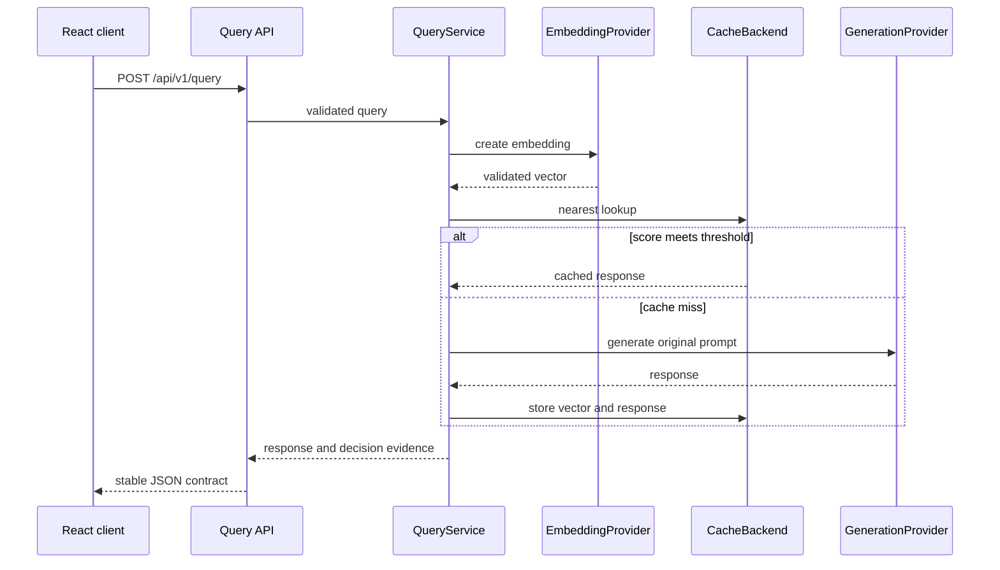

# Architecture

Semantix is a feature-first full-stack application. Features own their API,
orchestration, domain rules, and infrastructure only where those
responsibilities exist. Shared packages contain cross-feature composition and
utilities rather than feature behavior.

## Runtime flow



Identical in-flight requests are coalesced before repeated provider work.
Runtime counters observe the query path without storing prompt or response
content.

## Backend ownership

- `app/api` composes feature routers and cross-feature dependencies.
- `app/query/api` owns the query HTTP contract.
- `app/query/application` coordinates lookup, generation, storage, timing, and
  request coalescing.
- `app/query/domain` owns prompt normalization and effective cache policies.
- `app/cache/api` owns inspection, statistics, threshold, and invalidation
  routes.
- `app/cache/application` exposes semantic lookup and storage behavior.
- `app/cache/domain` owns keys, namespaces, metadata, vector validation, models,
  and backend ports.
- `app/cache/infrastructure` owns memory and pgvector adapters plus cache-table
  migrations.
- `app/benchmark` mirrors API, application, and domain responsibilities for the
  isolated evaluation laboratory; its infrastructure adapter owns persistent
  evaluation-dataset tables and repository behavior.
- `app/infrastructure` owns only the narrowly shared PostgreSQL pool,
  checksum/advisory-lock migration runner, runtime grants, and lifecycle
  composition used by cache and evaluation storage.
- `app/providers` owns application-facing protocols, startup composition, and
  concrete external adapters.
- `app/observability` stays flat because it is a small cohesive feature with
  process metrics, an allowlisted diagnostics endpoint, and one process-local
  collector.
- `app/core` owns configuration, errors, logging, and shared limits.

Routes and application services depend on protocols rather than concrete
provider or storage adapters. Startup composition in `app/lifecycle.py` and
provider/cache factories selects implementations from validated settings.

## Provider and cache ports

Embedding and generation use separate ports:

```python
class EmbeddingProvider(Protocol):
    async def create_embedding(self, text: str) -> Sequence[float]: ...


class GenerationProvider(Protocol):
    async def generate(self, prompt: str) -> str: ...
```

This permits combinations such as OpenAI embeddings with Anthropic generation.
The selected embedding dimensions flow into validation and cache composition;
vectors are never padded or truncated.

The cache application layer uses one backend port implemented by memory and
pgvector adapters. Both enforce compatible lookup, TTL, LRU, namespaces,
inspection, and statistics behavior.

## Frontend ownership

The React application has four lazy product workspaces and a not-found
fallback:

| Route | Feature |
|---|---|
| `/` | Namespace/policy query monitor, decision evidence, similarity trace, and session log |
| `/cache` | Cache inspection, search, sorting, deletion, and clearing |
| `/cache/entries/:cacheKey` | Authorized, best-effort live-cache entry evidence |
| `/evaluations` | Isolated controlled evaluation |
| `/observability` | Process-local runtime metrics and read-only diagnostics |
| `*` | Not-found page |

`/benchmarks` remains a compatibility URL. It replace-redirects to
`/evaluations` while preserving query parameters and fragments, so the
Evaluations workspace has one page implementation and one active navigation
item.

Each feature owns its pages, components, hooks, API adapter, types, and route
registry. `src/app/router` composes those registries and provides the shared
lazy loader. Shared providers keep cache statistics, threshold state, and the
monitor trace session alive across client-side navigation.

The Cache detail route reuses the existing Viewer-authorized single-entry API
and protected React Query key. It renders metadata and the bounded preview,
keeps delete server-authorized for Admin principals, and preserves Cache list
filters in the return URL. Evaluation cache keys never enter this route.

Monitor traces intentionally live in browser memory. Reloading starts a new
trace session; principal changes clear the local feature state. Non-private
traces retain only the prompt plus safe namespace, policy, score, latency, and
decision context. Private requests are omitted from trace collection. A live
hit can link its server-returned cache key to the authorized Cache detail route;
misses and evaluation keys cannot. Backend cache entries follow the configured
cache lifecycle.
Evaluation result state is route-local. Backend evaluation execution is
serialized and creates a fresh in-memory semantic cache per run, so completion,
failure, timeout, or cancellation cannot seed a later run or modify the
interactive cache and its runtime counters. Threshold alternatives are
frozen-candidate projections from one measured run, not repeated provider
executions.

Imported evaluation definitions begin at the same route-local boundary. The
frontend holds the selected parsed JSON object only in React state and clears
it on removal, unmount, sign-out, or principal change. Validation and inline
execution carry the object in bounded JSON requests. When persistent
evaluation storage is enabled, an Operator can make a separate explicit save
to a namespace-authorized PostgreSQL catalog; validation alone never writes.
The catalog stores immutable imported metadata and ordered cases, not run
results or generated responses. Canonical `/api/v1/evaluations/*` routes are
additive, while legacy built-in `/api/v1/benchmarks/*` routes remain
compatible.

## PostgreSQL lifecycle and migration ownership

The cache and persistent evaluation catalog share one pool only when either
feature needs PostgreSQL:

| Cache | Evaluation datasets | PostgreSQL lifecycle |
|---|---|---|
| `memory` | `session` | No pool and no database requirement |
| `memory` | `postgres` | One pool; apply evaluation migration `0002` |
| `pgvector` | `session` | One pool; apply cache migration `0001` |
| `pgvector` | `postgres` | One reused pool; apply `0001`, then `0002` |

The shared bootstrap creates only the `semantix` schema and checksum-protected
migration ledger. The cache migration remains responsible for the vector
extension and cache tables; the evaluation migration remains responsible for
dataset and case tables. Both use the existing advisory lock and deterministic
SHA-256 checksums. This keeps feature SQL feature-owned while avoiding two
independent pools, ledgers, or startup lifecycles.

## Project structure

```text
semantix/
├── backend/
│   ├── app/
│   │   ├── api/
│   │   ├── benchmark/{api,application,domain}/
│   │   ├── cache/{api,application,domain,infrastructure}/
│   │   ├── embedding/
│   │   ├── observability/
│   │   ├── providers/{adapters,shared}/
│   │   ├── query/{api,application,domain}/
│   │   ├── core/
│   │   ├── factory.py
│   │   ├── lifecycle.py
│   │   └── main.py
│   └── tests/                    # Mirrors feature ownership
├── frontend/
│   ├── src/
│   │   ├── app/
│   │   ├── features/
│   │   └── shared/
│   └── tests/                    # Mirrors app and features
├── ops/
│   ├── postgres/
│   └── load-testing/
├── docs/
└── docker-compose.yml
```

## Deployment boundary

The supplied deployment is intentionally single-instance and local-first:

- rate limiting, coalescing, runtime metrics, and runtime diagnostics are
  process-local;
- authentication can be disabled for trusted local development or configured
  with namespace-scoped token principals;
- CORS is configured for known local frontend origins;
- no distributed lock, message bus, or external metrics platform is included.

Production adaptation requires authentication, secret management, TLS,
distributed coordination where multiple replicas share work, and an explicit
data-retention model.
