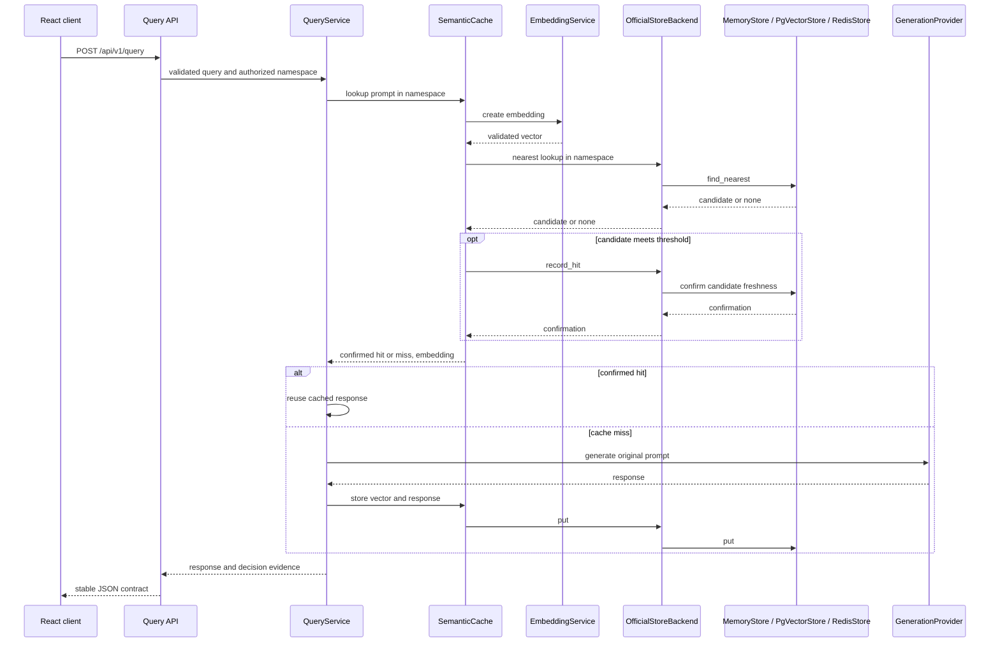

# Architecture

Semantix is a feature-first full-stack application. Features own their API,
orchestration, domain rules, and infrastructure only where those
responsibilities exist. Shared packages contain cross-feature composition and
utilities rather than feature behavior.

The independently installable `semantix-cache` library owns authoritative cache
entries, revisions, expiration, LRU and store-specific persistence. The optional
FastAPI server composes its official stores and owns HTTP contracts,
authentication, namespace authorization, request orchestration and telemetry.
The embedded library does not provide server authentication.

## Runtime flow


```mermaid
sequenceDiagram
    participant UI as React client
    participant API as Query API
    participant Query as QueryService
    participant Cache as SemanticCache
    participant Embed as EmbeddingService
    participant Backend as OfficialStoreBackend
    participant Store as MemoryStore / PgVectorStore / RedisStore
    participant Generate as GenerationProvider

    UI->>API: POST /api/v1/query
    API->>Query: validated query and authorized namespace
    Query->>Cache: lookup prompt in namespace
    Cache->>Embed: create embedding
    Embed-->>Cache: validated vector
    Cache->>Backend: nearest lookup in namespace
    Backend->>Store: find_nearest
    Store-->>Backend: candidate or none
    Backend-->>Cache: candidate or none
    opt candidate meets threshold
        Cache->>Backend: record_hit
        Backend->>Store: confirm candidate freshness
        Store-->>Backend: confirmation
        Backend-->>Cache: confirmation
    end
    Cache-->>Query: confirmed hit or miss, embedding
    alt confirmed hit
        Query->>Query: reuse cached response
    else cache miss
        Query->>Generate: generate original prompt
        Generate-->>Query: response
        Query->>Cache: store vector and response
        Cache->>Backend: put
        Backend->>Store: put
    end
    Query-->>API: response and decision evidence
    API-->>UI: stable JSON contract
```

The diagram shows the normal read/write-enabled path; a hit requires both threshold
eligibility and store confirmation. Private/bypass requests skip live-cache reads
and writes. Identical in-flight requests are coalesced within one process before
repeated provider work. Runtime counters observe the query path without storing
prompt or response content.

## Backend ownership

- `app/api` composes feature routers and cross-feature dependencies.
- `app/query/api` owns the query HTTP contract.
- `app/query/application` coordinates lookup, generation, storage, timing, and
  request coalescing.
- `app/query/domain` owns prompt normalization and effective cache policies.
- `app/cache/api` owns inspection, statistics, threshold, and invalidation
  routes.
- `app/cache/application` exposes semantic lookup and storage behavior.
- `app/cache/domain` owns keys, namespaces, metadata, vector validation, models,
  and backend ports.
- `app/cache/infrastructure` composes official stores through server adapters,
  translates inspection models, records request telemetry, and provides explicit
  storage setup. Authoritative cache persistence belongs to `semantix_cache`;
  legacy server cache migrations remain here.
- `app/benchmark` mirrors API, application, and domain responsibilities for the
  isolated evaluation laboratory; its infrastructure adapter owns persistent
  evaluation-dataset and optional aggregate run-history tables and repositories.
- `app/infrastructure` owns the shared PostgreSQL pool, checksum/advisory-lock
  migration runner, runtime grants, and lifecycle composition used by enabled
  database features. It also owns PostgreSQL coordination for rate buckets,
  authentication lockouts, and the global threshold.
- `app/providers` owns application-facing protocols, startup composition, and
  concrete external adapters.
- `app/observability` stays flat because it is a small cohesive feature with
  process metrics, an allowlisted diagnostics endpoint, and one process-local
  collector.
- `app/core` owns configuration, errors, logging, and shared limits.

Routes and application services depend on protocols rather than concrete
provider or storage adapters. Application creation freezes an explicit
provider registry, resolves the selected capabilities, and passes the resolved
metadata through `ProviderBundle` to lifespan and cache composition. The
default registry preserves all built-in providers; deployment bootstraps may
register trusted custom adapters before calling `create_app`.

## Provider and cache ports

Embedding and generation use separate ports:

```python
class EmbeddingProvider(Protocol):
    async def create_embedding(self, text: str) -> Sequence[float]: ...


class GenerationProvider(Protocol):
    async def generate(self, prompt: str) -> str: ...
```

This permits combinations such as OpenAI embeddings with Anthropic generation.
The selected embedding dimensions flow into validation and cache composition;
vectors are never padded or truncated.

Provider adapters own their wire payloads and response validation independently.
`app/providers/shared` supplies transport and common helpers; sharing an HTTPX
client does not make provider request/response contracts interchangeable.

The cache application layer uses the server's `CacheBackend` port. Its adapters
delegate authoritative operations to official stores:

| `CACHE_BACKEND` | Server adapter | Authoritative store | Server resource boundary |
|---|---|---|---|
| `memory` | `InMemoryCacheBackend` | `MemoryStore` | Process-local store |
| `pgvector` | `PgVectorCacheBackend` | `PgVectorStore` | Borrows the shared PostgreSQL pool |
| `redis` | `OfficialStoreBackend` | `RedisStore` | Connected store owns its Redis client/pool |

`InMemoryCacheBackend` and `PgVectorCacheBackend` extend `OfficialStoreBackend`.
`cache_backend_lifespan` constructs the selected store, validates persistent
bindings, and closes the store on exit. A supplied PostgreSQL pool stays borrowed;
when called without one, the pgvector factory fallback owns and closes the pool
it creates. The normal application lifespan supplies one shared pool.

The adapter maps store inspection to HTTP models and keeps separate request
hit/miss counters. Memory/Redis counters are process-local; pgvector counters use
`semantix.cache_namespace_counters`, scoped to the active embedding identity,
dimensions, schema and prefix. Entry hit metadata, revisions, expiry and LRU
remain authoritative in the official store. Process-local
`app/observability` metrics are another aggregate view, not a cache index.

Store-specific persistence, inspection, transaction, timeout and cancellation
contracts remain independently owned. See [server storage setup](../guides/platform-storage.md),
[embedded storage](../embedded-storage.md) and [Redis storage](../embedded-redis.md)
for the supported boundaries.

## Frontend ownership

The React application has four lazy product workspaces and a not-found
fallback:

| Route | Feature |
|---|---|
| `/` | Namespace/policy query monitor, decision evidence, similarity trace, and session log |
| `/cache` | Cache inspection, search, sorting, deletion, and clearing |
| `/cache/entries/:cacheKey` | Authorized, best-effort live-cache entry evidence |
| `/evaluations` | Isolated controlled evaluation |
| `/observability` | Process-local runtime metrics and read-only diagnostics |
| `*` | Not-found page |

`/benchmarks` remains a compatibility URL. It replace-redirects to
`/evaluations` while preserving query parameters and fragments, so the
Evaluations workspace has one page implementation and one active navigation
item.

Each feature owns its pages, components, hooks, API adapter, types, and route
registry. `src/app/router` composes those registries and provides the shared
lazy loader. Shared providers keep cache statistics, threshold state, and the
monitor trace session alive across client-side navigation.

The Cache detail route reuses the existing Viewer-authorized single-entry API
and protected React Query key. It renders metadata and the bounded preview,
keeps delete server-authorized for Admin principals, and preserves Cache list
filters in the return URL. Evaluation cache keys never enter this route.

Monitor traces intentionally live in browser memory. Reloading starts a new
trace session; principal changes clear the local feature state. Non-private
traces retain only the prompt plus safe namespace, policy, score, latency, and
decision context. Private requests are omitted from trace collection. A live
hit can link its server-returned cache key to the authorized Cache detail route;
misses and evaluation keys cannot. Backend cache entries follow the configured
cache lifecycle.
Evaluation result state is route-local. Backend evaluation execution is
serialized and creates a fresh in-memory semantic cache per run, so completion,
failure, timeout, or cancellation cannot seed a later run or modify the
interactive cache and its runtime counters. Threshold alternatives are
frozen-candidate projections from one measured run, not repeated provider
executions.

Imported evaluation definitions begin at the same route-local boundary. The
frontend holds the selected parsed JSON object only in React state and clears
it on removal, unmount, sign-out, or principal change. Validation and inline
execution carry the object in bounded JSON requests. When persistent
evaluation storage is enabled, an Operator can make a separate explicit save
to a namespace-authorized PostgreSQL catalog; validation alone never writes.
The catalog stores immutable imported metadata and ordered cases, not run
results or generated responses. Canonical `/api/v1/evaluations/*` routes are
additive, while legacy built-in `/api/v1/benchmarks/*` routes remain
compatible.

## PostgreSQL lifecycle and migration ownership

One server pool serves all enabled PostgreSQL features. These requirements combine;
turning on another database feature reuses the pool rather than creating another:

| Configuration | PostgreSQL lifecycle and setup |
|---|---|
| `memory` or `redis` cache, session datasets, disabled run history, memory coordination | No PostgreSQL pool or requirement |
| `CACHE_BACKEND=pgvector` | Explicit official cache setup plus server legacy/telemetry migration `0001` |
| Dataset or run-history storage set to `postgres` | Server evaluation migrations `0002` and `0003` |
| `COORDINATION_BACKEND=postgres` | Server coordination migration `0004` |

With `CACHE_BACKEND=pgvector`, `python -m app.infrastructure.migrate` uses
operator authority to enable pgvector, apply server legacy/telemetry setup,
initialize marked PgVectorStore tables, and grant runtime access. With the server
defaults, the active relations are:

- `semantix_cache.workbench_cache_entries`: official cache entries and metadata;
- `semantix_cache.workbench_binding_state`: embedding-space revision/access state;
- `semantix_cache.workbench_schema_migrations`: package migration version/checksum ledger.

`CACHE_PGVECTOR_SCHEMA` and `CACHE_PGVECTOR_TABLE_PREFIX` configure these names.
The package's `0001_cache.sql` and ledger are independent of server migration
`0001_pgvector_cache.sql` and `semantix.schema_migrations`. Server migration `0001`
retains the legacy `semantix.cache_entries` layout and server telemetry table.
Legacy answer/vector rows stay preserved; the official store neither serves,
converts nor adopts them. A new official binding starts empty.

The server runner protects its feature-owned migration batches with ordered
resources, an advisory lock, transactions and SHA-256 checksums. Evaluation
migrations own datasets/cases and terminal aggregate history; coordination owns
rate, lockout and global-threshold tables. Package migrations retain their own
ownership markers, locking and checksum validation.

Ordinary PostgreSQL/Redis cache startup validates the selected binding and never
initializes it. Development `DATABASE_MIGRATION_MODE=auto` applies only to other
enabled PostgreSQL features. Hardened Compose runs explicit PostgreSQL setup in
its one-shot migration service before backends, with separate migration/runtime
roles. Redis initialization uses its own explicit setup command and authority;
see [server storage setup](../guides/platform-storage.md).

## Project structure

```text
semantix/
├── apps/
│   ├── server/
│   │   ├── app/
│   │   │   ├── api/
│   │   │   ├── benchmark/{api,application,domain,infrastructure}/
│   │   │   ├── cache/{api,application,domain,infrastructure}/
│   │   │   ├── embedding/
│   │   │   ├── infrastructure/
│   │   │   ├── observability/
│   │   │   ├── providers/{adapters,shared}/
│   │   │   ├── query/{api,application,domain}/
│   │   │   ├── core/
│   │   │   ├── factory.py
│   │   │   ├── lifecycle.py
│   │   │   └── main.py
│   │   └── tests/                    # Mirrors feature ownership
│   └── web/
│       ├── src/
│       │   ├── app/
│       │   ├── features/
│       │   └── shared/
│       └── tests/                    # Mirrors app and features
├── packages/
│   ├── cache/
│   │   ├── src/semantix_cache/
│   │   └── tests/
│   └── client/
│       ├── src/semantix_client/
│       └── tests/
├── ops/
│   ├── postgres/
│   └── load-testing/
├── docs/
├── scripts/
├── .github/
├── docker-compose.yml
├── docker-compose.dev.yml
└── docker-compose.prod.yml
```

## Deployment boundary

The development deployment is local-first; production Compose runs two backends behind one gateway:

- coalescing, runtime metrics, and runtime diagnostics are process-local;
  production rate limiting and session-auth lockouts use PostgreSQL;
- authentication can be disabled for trusted local development or configured
  with namespace-scoped token principals;
- CORS is configured for known local frontend origins;
- no distributed request coalescer, message bus, or external metrics platform is included.

Production exposure requires authentication, secret management, TLS, provider
capacity planning, and an explicit data-retention model.
