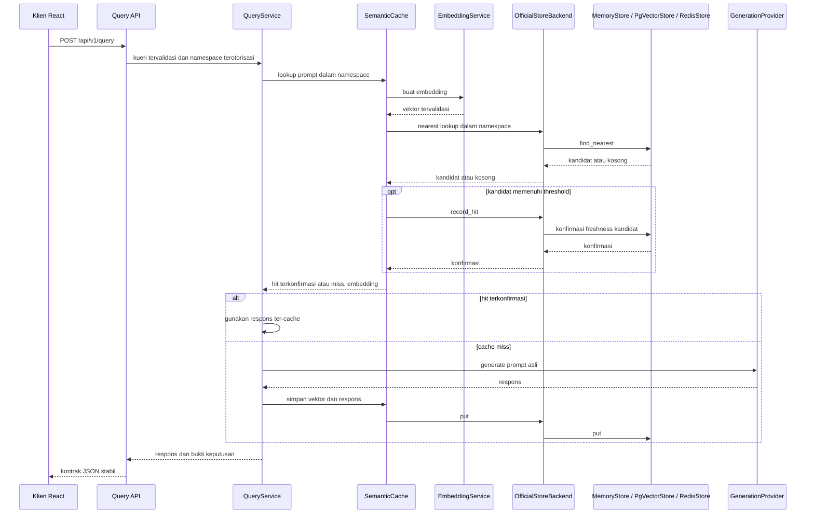

# Architecture

Semantix adalah aplikasi full-stack yang mengutamakan struktur feature-first. Fitur (feature) memiliki API, orkestrasi, aturan domain, dan infrastrukturnya sendiri — hanya untuk tanggung jawab yang memang menjadi miliknya. Paket bersama (shared packages) berisi komposisi lintas-fitur dan utilitas, bukan perilaku fitur itu sendiri.

Library `semantix-cache` yang dapat diinstal secara independen memiliki entri cache,
revision, expiration, LRU, dan persistensi khusus store yang otoritatif. Server
FastAPI opsional menyusun store resminya dan memiliki kontrak HTTP, authentication,
otorisasi namespace, orkestrasi request, dan telemetry. Library embedded tidak
menyediakan authentication server.

## Alur Runtime



Diagram menunjukkan alur normal dengan baca/tulis aktif; hit memerlukan eligibility
threshold sekaligus konfirmasi store. Request private/bypass melewati pembacaan dan
penulisan cache aktif. Request identik yang sedang berjalan digabungkan dalam satu
process sebelum pekerjaan provider berulang dilakukan. Counter runtime mengamati
alur query tanpa menyimpan konten prompt atau respons.

## Kepemilikan Backend

- `app/api` menyusun (compose) router fitur dan dependency lintas-fitur.
- `app/query/api` memiliki kontrak HTTP untuk query.
- `app/query/application` mengoordinasikan lookup, generation, penyimpanan, timing, dan request coalescing.
- `app/query/domain` memiliki normalisasi prompt dan cache policy yang efektif.
- `app/cache/api` memiliki route inspection, statistik, threshold, dan invalidation.
- `app/cache/application` mengekspos perilaku semantic lookup dan penyimpanan.
- `app/cache/domain` memiliki key, namespace, metadata, validasi vektor, model, dan backend port.
- `app/cache/infrastructure` menyusun store resmi melalui adapter server,
  menerjemahkan model inspection, mencatat telemetry request, dan menyediakan
  setup storage eksplisit. Persistensi cache yang otoritatif dimiliki
  `semantix_cache`; migrasi cache server legacy tetap berada di sini.
- `app/benchmark` mencerminkan tanggung jawab API, application, dan domain untuk
  laboratorium evaluasi terisolasi; adapter infrastructure-nya memiliki table dan
  repository dataset evaluasi persisten serta riwayat run agregat opsional.
- `app/infrastructure` memiliki pool PostgreSQL bersama, migration runner dengan
  checksum/advisory lock, runtime grants, dan komposisi lifecycle untuk fitur
  database aktif. Paket ini juga memiliki koordinasi PostgreSQL untuk rate bucket,
  authentication lockout, dan threshold global.
- `app/providers` memiliki protokol yang menghadap ke application, komposisi startup, dan adapter provider eksternal yang konkret.
- `app/observability` tetap flat karena merupakan fitur kohesif kecil dengan
  metrik process, endpoint diagnostics berbasis allowlist, dan satu collector
  process-local.
- `app/core` memiliki konfigurasi, error, logging, dan limit bersama.

Route dan application service bergantung pada protokol, bukan adapter provider atau
storage konkret. Pembuatan aplikasi membekukan registry provider eksplisit,
menentukan capability yang dipilih, lalu meneruskan metadata melalui `ProviderBundle`
ke lifespan dan komposisi cache. Registry default mempertahankan semua provider
bawaan; bootstrap deployment dapat mendaftarkan adapter kustom tepercaya sebelum
memanggil `create_app`.

## Port Provider dan Cache

Embedding dan generation menggunakan port yang terpisah:

```python
class EmbeddingProvider(Protocol):
    async def create_embedding(self, text: str) -> Sequence[float]: ...


class GenerationProvider(Protocol):
    async def generate(self, prompt: str) -> str: ...
```

Hal ini memungkinkan kombinasi seperti embedding OpenAI dengan generation Anthropic. Embedding dimensions yang dipilih mengalir ke dalam validasi dan komposisi cache; vektor tidak pernah di-padding atau dipotong (truncated).

Adapter provider memiliki wire payload dan validasi respons masing-masing secara
independen. `app/providers/shared` menyediakan transport dan helper bersama;
berbagi client HTTPX tidak membuat kontrak request/response provider saling dapat
dipertukarkan.

Application layer cache menggunakan port `CacheBackend` milik server. Adapter-nya
mendelegasikan operasi otoritatif ke store resmi:

| `CACHE_BACKEND` | Adapter server | Store otoritatif | Batas resource server |
|---|---|---|---|
| `memory` | `InMemoryCacheBackend` | `MemoryStore` | Store process-local |
| `pgvector` | `PgVectorCacheBackend` | `PgVectorStore` | Meminjam pool PostgreSQL bersama |
| `redis` | `OfficialStoreBackend` | `RedisStore` | Store yang terkoneksi memiliki client/pool Redis |

`InMemoryCacheBackend` dan `PgVectorCacheBackend` mewarisi `OfficialStoreBackend`.
`cache_backend_lifespan` membuat store terpilih, memvalidasi binding persisten, dan
menutup store saat keluar. Pool PostgreSQL yang disuplai tetap dipinjam; bila
fungsi dipanggil tanpa pool, fallback factory pgvector memiliki dan menutup pool
yang dibuatnya. Lifespan aplikasi normal menyuplai satu pool bersama.

Adapter menerjemahkan inspection store ke model HTTP dan menyimpan counter
hit/miss request secara terpisah. Counter memory/Redis bersifat process-local;
counter pgvector memakai `semantix.cache_namespace_counters`, dengan scope menurut
identitas embedding aktif, dimensions, schema, dan prefix. Metadata hit entri,
revision, expiry, dan LRU tetap otoritatif di store resmi. Metrik
process-local `app/observability` merupakan tampilan agregat lain, bukan indeks cache.

Kontrak persistensi, inspection, transaction, timeout, dan cancellation tetap
dimiliki masing-masing store secara independen. Lihat
[setup storage server](../../../guides/platform-storage.md),
[storage embedded](../../../embedded-storage.md), dan
[storage Redis](../../../embedded-redis.md) untuk batas dukungannya.

## Kepemilikan Frontend

Aplikasi React memiliki empat workspace produk yang lazy-loaded dan fallback
not-found:

| Route | Fitur |
|---|---|
| `/` | Query monitor dengan namespace/policy, bukti keputusan, similarity trace, dan session log |
| `/cache` | Inspeksi cache, pencarian, pengurutan, penghapusan, dan pembersihan |
| `/cache/entries/:cacheKey` | Bukti entri cache aktif yang diotorisasi, secara best-effort |
| `/evaluations` | Evaluasi terkontrol yang terisolasi |
| `/observability` | Metrik runtime process-local dan diagnostics read-only |
| `*` | Halaman not-found |

`/benchmarks` tetap tersedia sebagai URL kompatibilitas. Route ini melakukan
replace-redirect ke `/evaluations` sambil mempertahankan query parameter dan
fragment, sehingga workspace Evaluations memiliki satu implementasi halaman dan
satu item navigasi aktif.

Setiap fitur memiliki pages, components, hooks, API adapter, types, dan route
registry-nya sendiri. `src/app/router` menyusun registry tersebut dan menyediakan
lazy loader bersama. Provider bersama menjaga statistik cache, state threshold,
dan session trace monitor selama navigasi sisi klien.

Route detail Cache menggunakan kembali API entri tunggal yang diotorisasi untuk
Viewer dan query key React Query yang dilindungi. Route menampilkan metadata dan
preview terbatas, mempertahankan otorisasi penghapusan di server untuk principal
Admin, serta mempertahankan filter daftar Cache pada URL kembali. Key cache
evaluasi tidak masuk ke route ini.

Trace Monitor sengaja berada dalam memori browser. Reload memulai session trace
baru; perubahan principal membersihkan state fitur lokal. Trace non-private hanya
menyimpan prompt serta konteks namespace, policy, score, latency, dan keputusan
yang aman. Request private tidak dikumpulkan sebagai trace. Hit aktif dapat
menautkan cache key dari server ke route detail Cache yang diotorisasi; miss dan
key evaluasi tidak dapat melakukannya. Entri cache backend mengikuti lifecycle
cache yang dikonfigurasi.
State hasil evaluasi bersifat route-local. Eksekusi evaluasi backend diserialkan
dan membuat cache semantic memory baru per run, sehingga completion, failure,
timeout, atau cancellation tidak mengisi run berikutnya atau mengubah cache
interaktif dan counter runtime-nya. Alternatif threshold merupakan proyeksi
frozen-candidate dari satu run terukur, bukan eksekusi provider berulang.

Definisi evaluasi yang diimpor dimulai pada batas route-local yang sama. Frontend
menyimpan objek JSON terpilih hanya di React state dan membersihkannya saat
dihapus, unmount, sign-out, atau principal berubah. Validasi dan eksekusi inline
membawa objek tersebut dalam request JSON terbatas. Bila penyimpanan evaluasi
persisten aktif, Operator dapat menyimpan secara eksplisit melalui operasi
terpisah ke katalog PostgreSQL yang diotorisasi untuk namespace; validasi saja
tidak menulis data. Katalog menyimpan metadata impor immutable dan case berurutan,
bukan hasil run atau respons yang dihasilkan. Route kanonis
`/api/v1/evaluations/*` bersifat aditif, sedangkan route built-in legacy
`/api/v1/benchmarks/*` tetap kompatibel.

## Lifecycle PostgreSQL dan Kepemilikan Migration

Satu pool server melayani semua fitur PostgreSQL yang aktif. Kebutuhan berikut
dapat digabungkan; mengaktifkan fitur database lain menggunakan kembali pool
tersebut, bukan membuat pool tambahan:

| Konfigurasi | Lifecycle dan setup PostgreSQL |
|---|---|
| Cache `memory` atau `redis`, dataset session, riwayat run nonaktif, koordinasi memory | Tidak memerlukan pool atau PostgreSQL |
| `CACHE_BACKEND=pgvector` | Setup cache resmi eksplisit serta migration legacy/telemetry server `0001` |
| Storage dataset atau riwayat run diatur ke `postgres` | Migration evaluasi server `0002` dan `0003` |
| `COORDINATION_BACKEND=postgres` | Migration koordinasi server `0004` |

Dengan `CACHE_BACKEND=pgvector`, `python -m app.infrastructure.migrate` memakai
wewenang operator untuk mengaktifkan pgvector, menerapkan setup cache
legacy/telemetry server, menginisialisasi table PgVectorStore bertanda, dan
memberikan akses runtime. Dengan default server,
relasi aktif adalah:

- `semantix_cache.workbench_cache_entries`: entri dan metadata cache resmi;
- `semantix_cache.workbench_binding_state`: state revision/access embedding space;
- `semantix_cache.workbench_schema_migrations`: ledger version/checksum migration package.

`CACHE_PGVECTOR_SCHEMA` dan `CACHE_PGVECTOR_TABLE_PREFIX` mengonfigurasi nama tersebut.
`0001_cache.sql` dan ledger package independen dari migration server
`0001_pgvector_cache.sql` dan `semantix.schema_migrations`. Migration server `0001`
mempertahankan layout legacy `semantix.cache_entries` dan table telemetry server.
Baris jawaban/vektor legacy tetap dipertahankan; store resmi tidak melayani,
mengonversi, atau mengadopsinya. Binding resmi baru dimulai dalam keadaan kosong.

Runner server melindungi setiap batch migration milik fitur dengan resource
berurutan, advisory lock, transaction, dan checksum SHA-256. Migration evaluasi
memiliki dataset/case dan riwayat agregat terminal; koordinasi memiliki table rate,
lockout, dan threshold global. Migration package mempertahankan ownership marker,
locking, dan validasi checksum-nya sendiri.

Startup cache PostgreSQL/Redis biasa memvalidasi binding terpilih dan tidak pernah
menginisialisasinya. `DATABASE_MIGRATION_MODE=auto` pada development hanya berlaku
untuk fitur PostgreSQL lain yang aktif. Compose yang diperkeras menjalankan setup
PostgreSQL eksplisit dalam service migration sekali jalan sebelum backend, dengan
role migration/runtime terpisah. Inisialisasi Redis memakai perintah setup dan
wewenang eksplisit tersendiri; lihat
[setup storage server](../../../guides/platform-storage.md).

## Struktur Proyek

```text
semantix/
├── apps/
│   ├── server/
│   │   ├── app/
│   │   │   ├── api/
│   │   │   ├── benchmark/{api,application,domain,infrastructure}/
│   │   │   ├── cache/{api,application,domain,infrastructure}/
│   │   │   ├── embedding/
│   │   │   ├── infrastructure/
│   │   │   ├── observability/
│   │   │   ├── providers/{adapters,shared}/
│   │   │   ├── query/{api,application,domain}/
│   │   │   ├── core/
│   │   │   ├── factory.py
│   │   │   ├── lifecycle.py
│   │   │   └── main.py
│   │   └── tests/                    # Mencerminkan kepemilikan fitur
│   └── web/
│       ├── src/
│       │   ├── app/
│       │   ├── features/
│       │   └── shared/
│       └── tests/                    # Mencerminkan app dan features
├── packages/
│   ├── cache/
│   │   ├── src/semantix_cache/
│   │   └── tests/
│   └── client/
│       ├── src/semantix_client/
│       └── tests/
├── ops/
│   ├── postgres/
│   └── load-testing/
├── docs/
├── scripts/
├── .github/
├── docker-compose.yml
├── docker-compose.dev.yml
└── docker-compose.prod.yml
```

## Batasan Deployment

Deployment development bersifat local-first; Compose production menjalankan dua
backend di belakang satu gateway:

- coalescing, metrik runtime, dan diagnostics runtime bersifat process-local;
  rate limiting production dan lockout sesi autentikasi memakai PostgreSQL;
- authentication dapat dinonaktifkan untuk development lokal tepercaya atau
  dikonfigurasi dengan principal token yang dibatasi namespace;
- CORS dikonfigurasi untuk origin frontend lokal yang diketahui;
- tidak ada distributed request coalescer, message bus, atau platform metrik
  eksternal yang disertakan.

Eksposur production memerlukan authentication, manajemen secret, TLS, perencanaan
kapasitas provider, dan model retensi data yang eksplisit.
